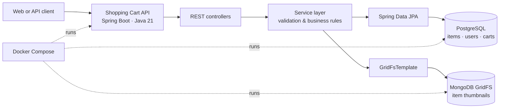

<div align="center">

# Shopping Cart API

### A containerized Java 21 / Spring Boot backend for catalog and cart workflows

[](https://www.oracle.com/java/)
[](https://spring.io/projects/spring-boot)
[](https://www.postgresql.org/)
[](https://www.mongodb.com/docs/manual/core/gridfs/)
[](https://www.docker.com/)

</div>

## Overview

Shopping Cart API is a Spring Boot backend for managing an item catalog and user cart entries. It keeps transactional application data in PostgreSQL and stores item thumbnails in MongoDB GridFS, with Docker Compose providing a reproducible local environment.

The repository's default branch, `backend`, contains the service. The project is documented from the implementation currently in that branch.

## What It Demonstrates

- **Catalog management** — create, read, list, and update items through REST endpoints.
- **Multipart uploads** — submit item metadata plus a thumbnail in one request.
- **Two datastore responsibilities** — PostgreSQL for item, user, and cart data; MongoDB GridFS for thumbnail files.
- **Consistency-minded file handling** — thumbnail uploads are compensated when item creation fails; replacement files are removed only after a successful item update.
- **Cart workflows** — add items, fetch all or per-user cart entries, modify quantities, and remove cart rows.
- **Backend structure** — controller, service, repository, DTO, model, and centralized exception-handling layers.
- **Containerized startup** — app, PostgreSQL, and MongoDB services are defined in Docker Compose.

## Architecture



## Tech Stack

| Area | Technology |
| --- | --- |
| Language & runtime | Java 21 |
| Application framework | Spring Boot 3.2, Spring Web |
| Persistence | Spring Data JPA, PostgreSQL |
| File storage | Spring Data MongoDB, MongoDB GridFS |
| API quality | Bean Validation, Springdoc OpenAPI / Swagger |
| Build & local delivery | Maven Wrapper, Docker, Docker Compose |
| Code ergonomics | Lombok |

## Run Locally

### With Docker Compose

1. Clone the backend branch:

   ```bash
   git clone --branch backend https://github.com/its-ok-zid/Shopping-Cart.git
   cd Shopping-Cart
   ```

2. Set a database password and start the stack.

   **PowerShell**

   ```powershell
   $env:POSTGRES_PASSWORD = "change-me"
   docker compose up --build
   ```

   **macOS / Linux**

   ```bash
   POSTGRES_PASSWORD=change-me docker compose up --build
   ```

3. The API starts at `http://localhost:9081`. When the Springdoc UI is available, open `http://localhost:9081/swagger-ui/index.html`.

Docker Compose supplies the application with its PostgreSQL and MongoDB connection settings. The Postgres and Mongo volumes persist data between restarts.

### With a Local JDK

Use JDK 21 and provide the datasource and MongoDB environment variables expected by `application.properties`:

```text
DATABASE_URL
DATABASE_USERNAME
DATABASE_PASSWORD
MONGODB_URI
MONGODB_DATABASE
APP_THUMBNAIL_GRIDFS_BUCKET
```

Then run:

```bash
./mvnw spring-boot:run
```

On Windows:

```powershell
./mvnw.cmd spring-boot:run
```

## API Surface

| Method | Endpoint | Purpose |
| --- | --- | --- |
| `GET` | `/api/items` | List catalog items |
| `GET` | `/api/items/{id}` | Fetch one item |
| `POST` | `/api/items` | Create an item with a thumbnail |
| `PUT` | `/api/items/{id}` | Update item metadata and optionally replace its thumbnail |
| `POST` | `/api/usercart/add` | Add an item to a user's cart |
| `GET` | `/api/usercart/all` | List cart entries |
| `GET` | `/api/usercart/user?userId={id}` | List a user's cart entries |
| `PUT` | `/api/usercart/modify` | Change a cart item's quantity |
| `DELETE` | `/api/usercart/remove` | Remove a cart item |

### Create an Item

```bash
curl -X POST http://localhost:9081/api/items \
  -H "Accept: application/json" \
  -F 'item={"name":"Wireless Headphones","description":"Over-ear headphones","cost":99.99,"mfrNo":"WH-100","stock":20};type=application/json' \
  -F "thumbnail=@./headphones.png"
```

> Cart endpoints work with persisted users. User-provisioning endpoints are not included in this repository.

## Testing

The project includes application, controller, repository, and service-layer tests. With local dependencies configured, run:

```bash
./mvnw test
```

## Project Scope

This repository currently focuses on the backend service. A production deployment would be strengthened by adding an authenticated user flow, authorization rules around catalog and cart operations, a client application, and checkout/payment integration.

## Repository Structure

```text
src/main/java/com/cts/
├── controller/        # Item and cart HTTP endpoints
├── dto/               # Request and response contracts
├── exception/         # Centralized API error handling
├── model/             # JPA entities
├── repository/        # PostgreSQL data access
├── service/           # Service contracts
└── serviceImpl/       # Catalog, cart, and GridFS implementations

src/main/resources/
└── application.properties

Dockerfile
docker-compose.yml
pom.xml
```

## Next Improvements

- Add authenticated user registration and authorization around cart ownership.
- Add pagination, filtering, and stock reservation for catalog workflows.
- Expand automated test coverage and add API contract tests.
- Add CI checks and deployment configuration.
- Pair the API with a production-ready frontend and checkout flow.

---

Built as a portfolio project by [Zidan Ali](https://github.com/its-ok-zid).
